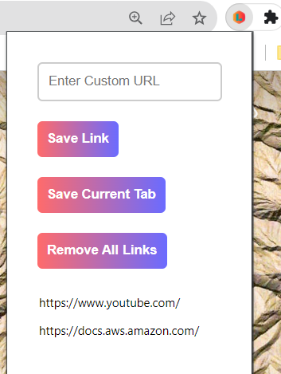

# Logger Extension

Logger is a browser extension that allows you to save and manage URLs. You can use it to store custom URLs or quickly save the URL of the currently open tab. This README provides an overview of the extension's features and instructions for installation and usage.

## Features

- Save custom URLs.
- Save the URL of the currently open tab.
- Remove all saved links.
- Save links from any website with a single click.

## Screenshots

## Installation

1. Clone or download this repository to your local machine.

2. Open your browser (Google Chrome or Chromium-based browser).

3. Navigate to `chrome://extensions/`.

4. Enable "Developer mode" at the top right corner of the extensions page.

5. Click on the "Load unpacked" button.

6. Select the directory where you cloned or downloaded the extension files.

7. The Logger extension will now be installed in your browser.

## Usage

1. **Saving Custom URLs:**
   - Enter a custom URL in the input field.
   - Click the "Save Link" button to save the URL.
   - The saved URL will appear in the list below.

2. **Saving the Current Tab:**
   - Click the "Save Current Tab" button to save the URL of the currently open tab.
   - The URL will be added to the list.

3. **Removing All Links:**
   - Double-click the "Remove All Links" button to clear all saved links.

## Contributing

If you'd like to contribute to this project, please follow these steps:

1. Fork the repository.

2. Clone your forked repository to your local machine.

3. Create a new branch for your feature or bug fix.

4. Make your changes and test them thoroughly.

5. Commit your changes and push them to your forked repository.

6. Create a pull request to merge your changes into the main repository.

## License

This project is licensed under the MIT License. This means that you are free to use, modify, and distribute the code for any purpose, including commercial use. See the [LICENSE](LICENSE) file for details.

## Made with love by Hari Om

I created this extension to help people save and manage their favorite links. I hope you find it useful!

## Support

If you have any questions or feedback, please feel free to contact me at
